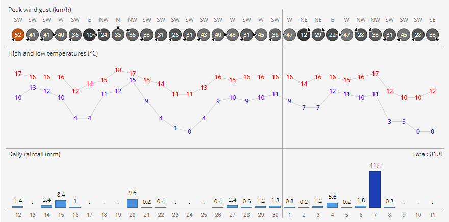

# DailyWeatherGraph

This is a script (and associated CSS styles) for creating an SVG graph of daily weather observations.
Plots daily rainfall totals, low and high temperatures, and daily high wind gusts and their directions.

Requires the D3.js library. Example:



You create a new graph like this, where `config` is a configuration object:
```javascript
var graph = new DailyWeatherGraph(config);
```

The current options you **must** specify are:

+ ***container*** - HTML element where the chart will be drawn within.
+ ***data*** - the data for the chart - see test.js for an example of what format this should be in.

Additional options you can specify are:

+ ***width*** - width of the chart in pixels, default `800`.
+ ***height*** - height of the chart in pixels, default `375`.
+ ***dateFormat*** - date format string for parsing the dates in your dataset. See <a href="https://github.com/mbostock/d3/wiki/Time-Formatting">d3.time.format</a> for accepted formats. Default `'%y-%m-%d'`.
+ ***missingValue*** - the value used in the data to represent a missing value, default `-100`.
+ ***missingValueText*** - the label to use in the chart for missing values. Defaults to `'n/a'`.
+ ***temperatureUnit*** - temperature unit. Either `'C'` for Celsius or `'F'` for Fahrenheit. Defaults to `'C'`.
+ ***rainfallUnit*** - rainfall unit. Either `'mm'` or `'inches'`. Defaults to `'mm'`.
+ ***windUnit*** - wind gust unit. One of `'km/h'`, `'mph'`, `'knots'`, `'m/s'`. Defaults to `'km/h'`.
